# NIST Hacking Case 2004-09-20

This is the original link to the hacking case: https://cfreds-archive.nist.gov/Hacking_Case.html

## Background Information
This hacking case is one of several Computer Forensic Reference Data Sets (CFReDS) provided by the US government's NIST (National Institute of Standards and Technology) to aid investigators in:
<ul>
    <li>validating software tools used in their investigations</li>
    <li>checking equipment</li>
    <li>training investigators</li>
    <li>testing investigators on proficiency for lab accreditation</li>
</ul>

## Scenario 
On 09/20/04 , a Dell CPi notebook computer, serial # VLQLW, was found abandoned along with a wireless PCMCIA card and an external homemade 802.11b antennae. It is suspected that this computer was used for hacking purposes, although cannot be tied to a hacking suspect, G=r=e=g S=c=h=a=r=d=t. (The equal signs are just to prevent web crawlers from indexing this name; there are no equal signs in the image files.)  Schardt also goes by the online nickname of “Mr. Evil” and some of his associates have said that he would park his vehicle within range of Wireless Access Points (like Starbucks and other T-Mobile Hotspots) where he would then intercept internet traffic, attempting to get credit card numbers, usernames & passwords.

Find any hacking software, evidence of their use, and any data that might have been generated. Attempt to tie the computer to the suspect, G=r=e=g S=c=h=a=r=d=t.

## Tools
I will be using primarily Autopsy 4.21.0 (latest version as of 2024-10-22) to investigate this case.

## Initial Walkthrough and Case Setup
Let's start up Autopsy 4.21.0 and set up a case. Click <strong>New Case</strong>.

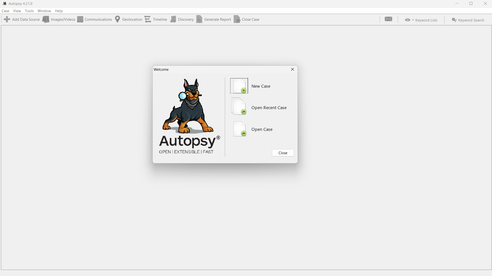

Set a case name. The additional information like case number is optional. Click <strong>Next</strong> and then <strong>Finish</strong>.

Add the data source. Click <strong>Next</strong>.

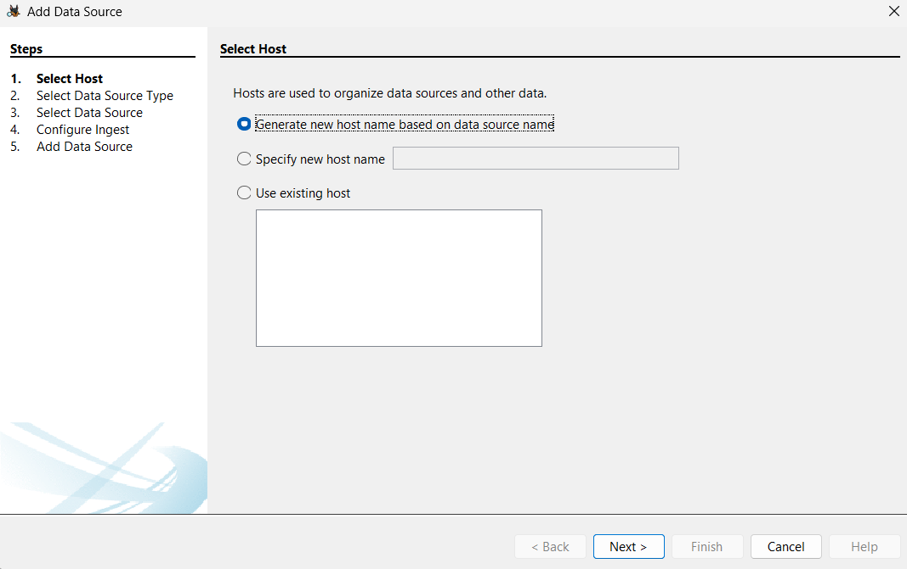

For Data Source Type, select <strong>Disk Image or VM File</strong>. Click <strong>Next</strong>.

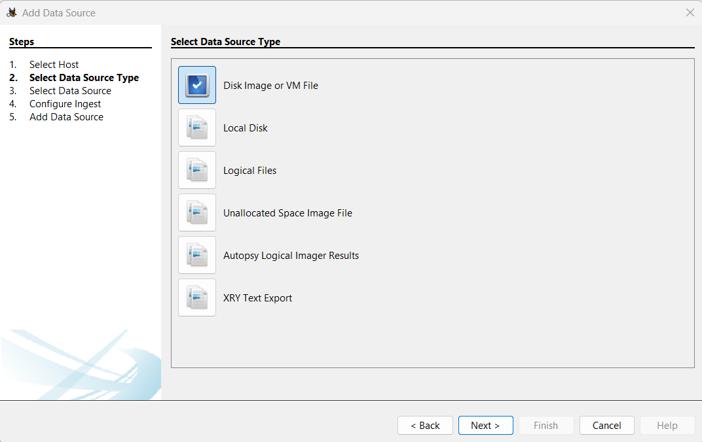

Point to the image. In my case, I downloaded the spanned DD image, so I pointed the path of the first segment. Autopsy will automatically recognize the spanned image when you point to the first segment. Click <strong>Next</strong>.

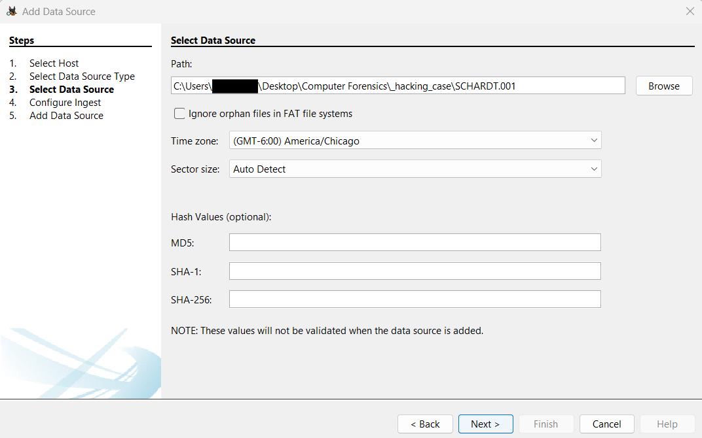

On the <bold>Configure Ingest</bold> step, there are multiple ingest modules. Most of them are available for free by default. Note: Cyber Triage Malware Scanner requires a paid license to scan the image for malware. Let's select all to see what happens. Click <strong>Next</strong>.

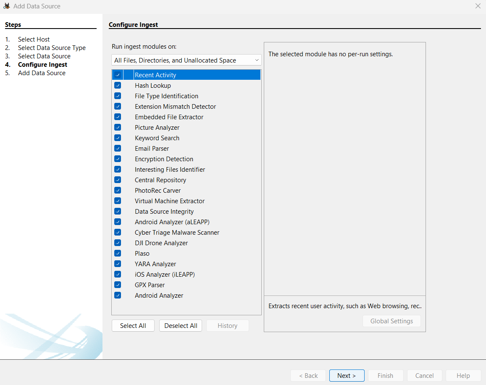

Click <strong>Finish</strong> on the last step.

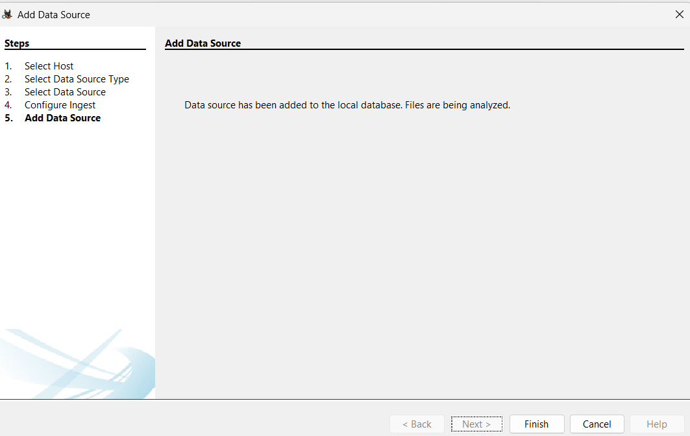

Autospy will then begin ingesting. Note the bottom right corner showing the ingest progress.

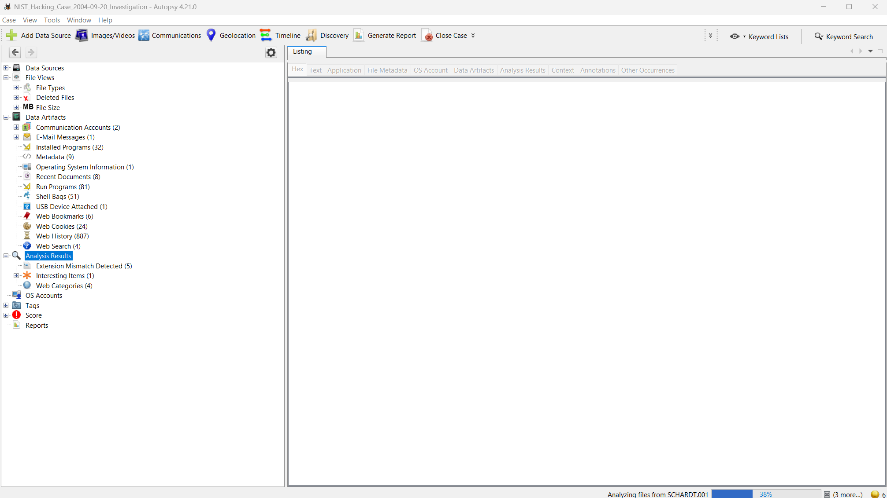

After the ingest, you can click on the bottom right and see the errors and findings post-ingest.

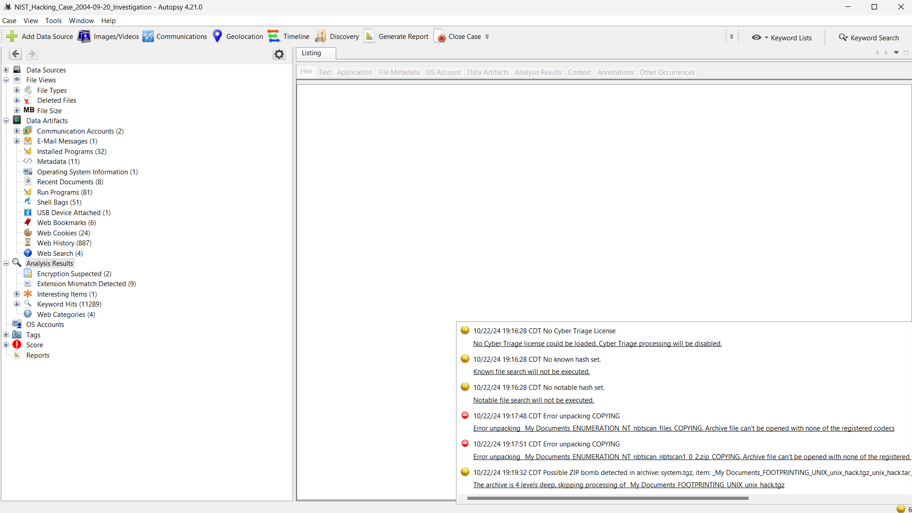

## Questions and Answers
### 1. What is the image hash? Does the acquisition and verification hash match?
The acquisition log provided by NIST does not appear to have the image hash of the entire image.

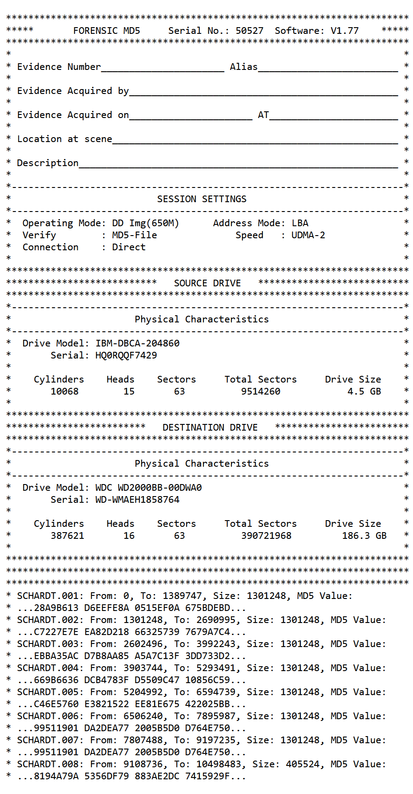

There are different ways to find the image hash. One way is to simply click on the image on the <strong>Data Sources</strong> node and check the Results Viewer on the bottom under the <strong>File Metadata</strong> tab.

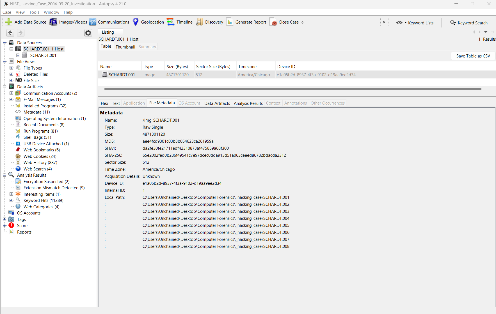

Another method is to click right-click on the image from the <strong>Data Sources</strong> node and select the <strong>View Summary Information</strong> option.

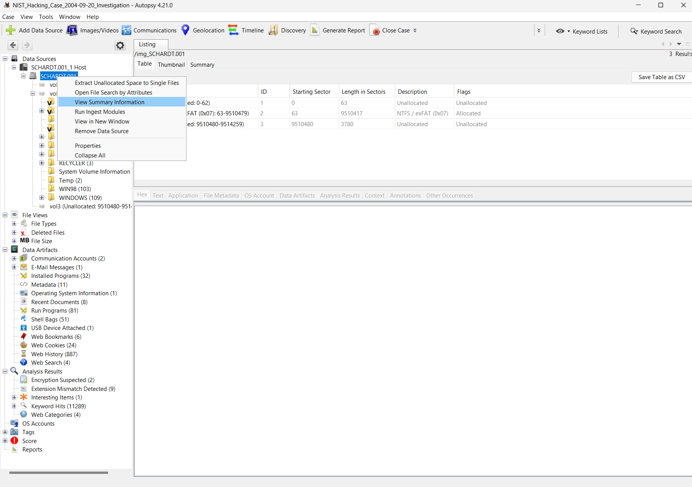

Then select the image and go to the <strong>Container</strong> tab.

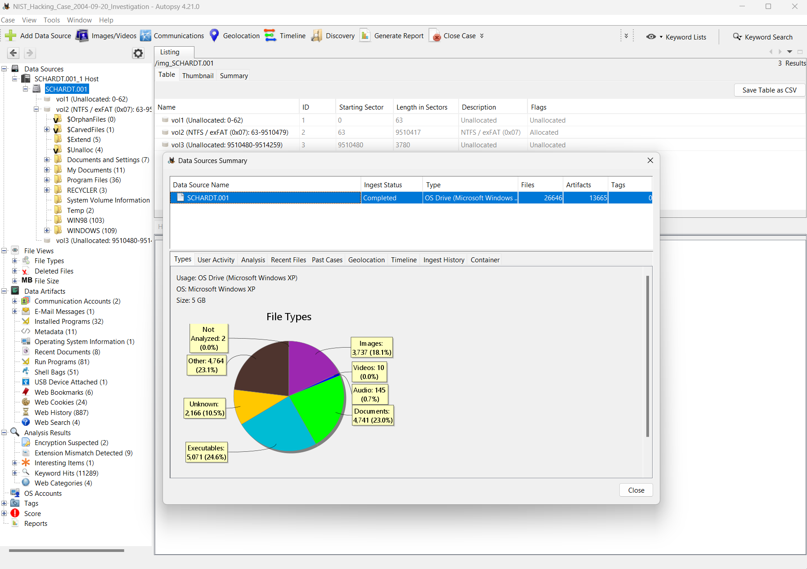
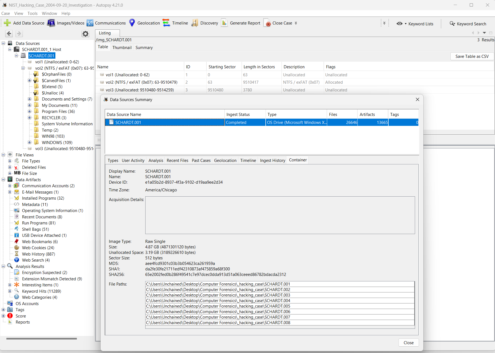

### 2. What operating system was used on the computer?
### 3. When was the install date?
### 4. What is the timezone settings?
### 5. Who is the registered owner?
### 6. What is the computer account name?
### 7. What is the primary domain name?
### 8. When was the last recorded computer shutdown date/time?
### 9. How many accounts are recorded (total number)?
### 10. What is the account name of the user who mostly uses the computer?
### 11. Who was the last user to logon to the computer?
### 12. A search for the name of “G=r=e=g S=c=h=a=r=d=t” reveals multiple hits. One of these proves that G=r=e=g S=c=h=a=r=d=t is Mr. Evil and is also the administrator of this computer. What file is it? What software program does this file relate to?
### 13.  List the network cards used by this computer
### 14. This same file reports the IP address and MAC address of the computer. What are they?
### 15. An internet search for vendor name/model of NIC cards by MAC address can be used to find out which network interface was used. In the above answer, the first 3 hex characters of the MAC address report the vendor of the card. Which NIC card was used during the installation and set-up for LOOK@LAN?
### 16. Find 6 installed programs that may be used for hacking.
### 17. What is the SMTP email address for Mr. Evil?
### 18. What are the NNTP (news server) settings for Mr. Evil?
### 19. What two installed programs show this information?
### 20. List 5 newsgroups that Mr. Evil has subscribed to?
### 21. A popular IRC (Internet Relay Chat) program called MIRC was installed.  What are the user settings that was shown when the user was online and in a chat channel?
### 22. This IRC program has the capability to log chat sessions. List 3 IRC channels that the user of this computer accessed.
### 23. Ethereal, a popular “sniffing” program that can be used to intercept wired and wireless internet packets was also found to be installed. When TCP packets are collected and re-assembled, the default save directory is that users \My Documents directory. What is the name of the file that contains the intercepted data?
### 24. Viewing the file in a text format reveals much information about who and what was intercepted. What type of wireless computer was the victim (person who had his internet surfing recorded) using?
### 25. What websites was the victim accessing?
### 26. Search for the main users web based email address. What is it?
### 27. Yahoo mail, a popular web based email service, saves copies of the email under what file name?
### 28. How many executable files are in the recycle bin?
### 29. Are these files really deleted?
### 30. How many files are actually reported to be deleted by the file system?
### 31. Perform a Anti-Virus check. Are there any viruses on the computer?
