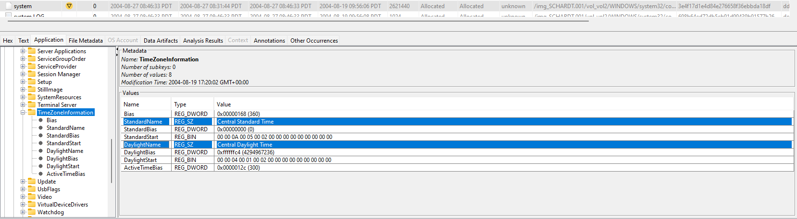
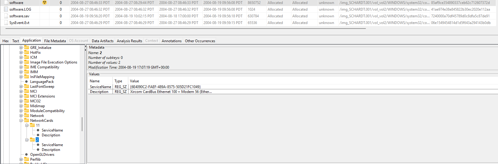

# NIST Hacking Case 2004-09-20

This is the original link to the hacking case: https://cfreds-archive.nist.gov/Hacking_Case.html

## Background Information
This hacking case is one of several Computer Forensic Reference Data Sets (CFReDS) provided by the US government's NIST (National Institute of Standards and Technology) to aid investigators in:
<ul>
    <li>validating software tools used in their investigations</li>
    <li>checking equipment</li>
    <li>training investigators</li>
    <li>testing investigators on proficiency for lab accreditation</li>
</ul>

## Scenario 
On 09/20/04 , a Dell CPi notebook computer, serial # VLQLW, was found abandoned along with a wireless PCMCIA card and an external homemade 802.11b antennae. It is suspected that this computer was used for hacking purposes, although cannot be tied to a hacking suspect, G=r=e=g S=c=h=a=r=d=t. (The equal signs are just to prevent web crawlers from indexing this name; there are no equal signs in the image files.)  Schardt also goes by the online nickname of “Mr. Evil” and some of his associates have said that he would park his vehicle within range of Wireless Access Points (like Starbucks and other T-Mobile Hotspots) where he would then intercept internet traffic, attempting to get credit card numbers, usernames & passwords.

Find any hacking software, evidence of their use, and any data that might have been generated. Attempt to tie the computer to the suspect, G=r=e=g S=c=h=a=r=d=t.

## Tools
I will be using the free open-source tool Autopsy 4.21.0 (latest version as of 2024-10-22) to investigate this case.

## Initial Walkthrough and Case Setup
Let's start up Autopsy 4.21.0 and set up a case. Click <strong>New Case</strong>.

Set a case name. The additional information like case number is optional. Click <strong>Next</strong> and then <strong>Finish</strong>.

Add the data source. Click <strong>Next</strong>.

For Data Source Type, select <strong>Disk Image or VM File</strong>. Click <strong>Next</strong>.

Point to the image. In my case, I downloaded the spanned DD image, so I pointed the path of the first segment. Autopsy will automatically recognize the spanned image when you point to the first segment. Click <strong>Next</strong>.

On the <bold>Configure Ingest</bold> step, there are multiple ingest modules. Most of them are available for free by default. Note: Cyber Triage Malware Scanner requires a paid license to scan the image for malware. Let's select all to see what happens. Click <strong>Next</strong>.

Click <strong>Finish</strong> on the last step.

Autospy will then begin ingesting. Note the bottom right corner showing the ingest progress.

After the ingest, you can click on the bottom right and see the errors and findings post-ingest.

## Questions and Answers
### 1. What is the image hash? Does the acquisition and verification hash match?
The image hashes by algorithm are the following: 
MD5: aee4fcd9301c03b3b054623ca261959a 
SHA1: da2fe30fe21711edf42310873af475859a68f300 
SHA-256: 65e2002fed0b286f49541c7e97dcec0dda913d51a063ceeed86782bdacda2312 

The acquisition log provided by NIST does not appear to have the image hash of the entire image. The hash provided by NIST is the MD5 hash value of AEE4FCD9301C03B3B054623CA261959A, which is a match.

There are different ways to find the image hash. One way is to simply click on the image in the Results Viewer and then checking the bottom pane under the <strong>File Metadata</strong> tab.

Another method is to click right-click on the image from the <strong>Data Sources</strong> node and select the <strong>View Summary Information</strong> option.

Then select the image and go to the <strong>Container</strong> tab.

### 2. What operating system was used on the computer?
Windows XP

Autopsy automatically parses this information under Tree Viewer's <strong>Data Artifacts</strong> node: <strong>Operating System Information</strong>

If Autopsy didn't automatically provide this as an artifact, we can also look for the information in the SOFTWARE registry hive: 
<strong>\img_SCHARDT.001\vol_vol2\WINDOWS\system32\config\software</strong>

The operating system information should be under the <strong>CurrentVersion</strong> registry key within the SOFTWARE hive: 
<strong>software\Microsoft\Windows NT\CurrentVersion</strong>

We can navigate to the registry key by selecting the <strong>Application</strong> tab in the Results Viewer after selecting the SOFTWARE hive file.

According to <a href="https://learn.microsoft.com/en-us/windows-hardware/drivers/devtest/overview-of-the-boot-ini-file" target="_blank">Microsoft</a>: 
<em>The <strong>Boot.ini</strong> file is a text file that contains the boot options for computers with BIOS firmware running NT-based operating system prior to Windows Vista. It's located at the root of the system partition, typically <strong>c:\Boot.ini</strong>.</em>

For operating systems before Windows Vista (2006), we can also use the <strong>boot.ini</strong> file to determine the operating system.

### 3. When was the install date?
Thursday, August 19, 2004 10:48:27 PM GMT or
 
Thursday, August 19, 2004 5:48:27 PM GMT-05:00 (local US Central Time)

The install date can be found in the <strong>InstallDate</strong> value, which is also within the <strong>CurrentVersion</strong> registry key within the SOFTWARE hive.

The install date is provided in both hexadecimal and decimal form. Note the 0x that precedes the numbers. This signifies hexadecimal form. 
The number in parentheses represents the decimal number in UNIX time. UNIX time is a date and time representation widely used in computing that measures the time elapsed since 00:00:00 UTC on 1 January 1970, the Unix epoch.

To convert to human-readable date, we need to convert epoch from seconds to human date. A website that can help with converting to human date is https://www.epochconverter.com/
 

### 4. What is the timezone settings?
Central Daylight Time (-05hrs GMT)

To find the Time Zone Information, we can look at the <strong>TimeZoneInformation</strong> registry value within the SYSTEM registry hive.

The SYSTEM hive is in the following location: 
<strong>\img_SCHARDT.001\vol_vol2\WINDOWS\system32\config\system</strong>

After selecting the SYSTEM hive file, we can navigate to the <strong>TimeZoneInformation</strong> registry value under the <strong>Application</strong> tab:
<strong>system\CurrentControlSet</strong>[00X]<strong>\Control\TimeZoneInformation</strong>

Note: It's common to see two Control Sets, <strong>ControlSet001</strong> and <strong>ControlSet002</strong>. In most cases (but not always), <strong>ControlSet001</strong> will point to the Control Set that the machine booted with, and <strong>ControlSet002</strong> will be the last known good configuration. 

### 5. Who is the registered owner?
Greg Schardt

The registered owner can also be found under the SOFTWARE hive's <strong>CurrentVersion</strong> registry key but this time under the <strong>RegisteredOwner</strong> value: 
<strong>software\Microsoft\Windows NT\CurrentVersion</strong>

### 6. What is the computer account name?

Mr. Evil

Autopsy automatically parses the SAM registry and provides the accounts information under the <strong>OS Accounts</strong> node in the Tree Viewer. 

User ID above 1000, ie., 1003, means a custom-made account, not a default one.

Based on the User ID, login count, and description, "Mr. Evil" is the only valid custom-made user account. The other account with a User ID greater than 1000 is the vendor's account and has 0 login counts.

The computer account name can be found in the SAM registry hive as well as the SOFTWARE hive.

The SAM (Security Account Manager) registry hive contains user account, login, and group information.

The SAM registry hive is in the following location: 
<strong>\img_SCHARDT.001\vol_vol2\WINDOWS\system32\config\SAM</strong>

We can navigate to the Users key: 
<strong>SAM\Domains\Account\Users</strong>

Unfortunately, Autopsy's <strong>Application</strong> view does not provide much information on the SAM registry hive's <strong>Users</strong> key. However, all the essential information can be seen in the aforementioned <strong>OS Accounts</strong> node in the Tree Viewer.

We can also look in the SOFTWARE hive's <strong>Winlogon</strong> key under the <strong>DefaultUserName</strong> value: 
<strong>software\Microsoft\Windows NT\CurrentVersion\Winlogon</strong>

### 7. What is the primary domain name?
N-1A9ODN6ZXK4LQ

Domain name or workgroup is a subset of the computer name.

The computer account name can be found under the SYSTEM hive's <strong>ComputerName</strong> key: 
<strong>system\CurrentControlSet</strong>[00X]<strong>\Control\ComputerName</strong>

The same domain name can be found under the SOFTWARE hive's <strong>Winlogon</strong> key under the <strong>DefaultDomainName</strong> value: 
<strong>software\Microsoft\Windows NT\CurrentVersion\Winlogon</strong>

### 8. When was the last recorded computer shutdown date/time?
2004-08-27 10:46:33 AM Central Daylight Time.

The last recorded shutdown time can be found in the SYSTEM registry hive's <strong>Windows</strong> key: 
<strong>system\CurrentControlSet\Control\Windows</strong>

The <strong>ShutdownTime</strong> value is in little endian hexadecimal form, which will need to be converted to human-readable form.

I used 
<a href="https://icyberchef.com" target="_blank">https://icyberchef.com</a>
to convert from hexadecimal (little Endian) time to human readable date. The spaces between the hexadecimals need to be removed prior to conversion. 
The first conversion is from the little endian (without spaces) hexadecimal number to the epoch time in seconds. 
The seconds represents the time elapsed since 00:00:00 UTC on 1 January 1970, the Unix epoch. And from the seconds, we can determine the exact date/time.

The human readable date in UTC time is "Fri 27 August 2004 15:46:33 UTC."

The link to the conversion recipe I used is 
<a href="https://icyberchef.com/#recipe=Remove_whitespace(true,false,false,false,false,false)Windows_Filetime_to_UNIX_Timestamp('Seconds%20(s)','Hex%20(little%20endian)')From_UNIX_Timestamp('Seconds%20(s)')&input=QzQgRkMgMDAgMDcgNEQgOEMgQzQgMDEg" target="_blank">here</a>.

The outputted date is in UTC, so we need to subtract by 5 hours to get 2004-08-27 10:46:33 AM Central Daylight Time.

### 9. How many accounts are recorded (total number)?
Five accounts

As mentioned in Question 6, the <strong>OS Accounts</strong> node in the Tree Viewer shows all the accounts.

There are five accounts, each with a creation time. 

### 10. What is the account name of the user who mostly uses the computer?
<strong>Mr. Evil</strong> has the most login counts at 15.

### 11. Who was the last user to logon to the computer?
<strong>Mr. Evil</strong> is the only account with a last login.

### 12. A search for the name of “G=r=e=g S=c=h=a=r=d=t” reveals multiple hits. One of these proves that G=r=e=g S=c=h=a=r=d=t is Mr. Evil and is also the administrator of this computer. What file is it? What software program does this file relate to?
Autopsy has the file path as (because the 001 image was loaded): 
<strong>\img_SCHARDT.001\vol_vol2\Program Files\Look@LAN\irunin.ini</strong>

From the user view in Windows XP, the file would normally be in the C:\ drive's Program Files directory: 
<strong>C:\Program Files\Look@LAN\irunin.ini</strong>

Look@LAN is the software program, and it is used for network monitoring.

### 13.  List the network cards used by this computer
Xircom CardBus Ethernet 100 + Modem 56 (Ethernet Interface) 
Compaq WL110 Wireless LAN PC Card

The network cards can be found in the <strong>NetworkCards</strong> registry key within the software registry hive: 
<strong>software\Microsoft\Windows NT\CurrentVersion\NetworkCards</strong>

Another registry key we can look at for network information is the <strong>Network</strong> key in the SYSTEM hive: 
<strong>system\ControlSet001\Control\Network</strong>

This method may require drilling down under the GUIDs to look at <strong>Descriptions</strong> values as shown below.

### 14. This same file reports the IP address and MAC address of the computer. What are they?
The file <strong>\img_SCHARDT.001\vol_vol2\Program Files\Look@LAN\irunin.ini</strong> has the following text: 
<strong>
%LANIP%=192.168.1.111  
%LANNIC%=0010a4933e09  
</strong>

This is the same file that came up when searching for "Greg Schardt" in Question 12.

### 15. An internet search for vendor name/model of NIC cards by MAC address can be used to find out which network interface was used. In the above answer, the first 3 hex characters of the MAC address report the vendor of the card. Which NIC card was used during the installation and set-up for LOOK@LAN?
The Xircom NIC was used.

The first 3 hexadecimals of a MAC address is the OUI (Organizational Unique Identifier). The OUI is the part of the MAC address that identifies the vendor of the network adapter. The OUI is the first three bytes of the six-byte field in a MAC address and is administered by the IEEE (Institute of Electrical and Electronics Engineers).

A <a href="https://maclookup.app/macaddress/0010a4" target="_blank">search</a> for the OUI "0010a4" reveals the vendor Xircom.

### 16. Find 6 installed programs that may be used for hacking.
123 Write All Stored Passwords (finds passwords in registry)
Anonymizer (hides IP tracks when browsing)
CuteFTP (FTP software)
Look&LAN_1.0 (network discovery tool)
NetStumbler (wireless access point discovery tool)

Installed programs can be found in Program Files.

Cain & Abel v2.5 beta45 
<ul>
    <li>password sniffer & cracker</li>
    <li>Cain and Abel (often abbreviated to Cain) was a password recovery tool for Microsoft Windows. It could recover many kinds of passwords using methods such as network packet sniffing, cracking various password hashes by using methods such as dictionary attacks, brute force and cryptanalysis attacks.</li>
    <ul><li>Cryptanalysis attacks were done via rainbow tables which could be generated with the <strong>winrtgen.exe</strong> program provided with Cain and Abel</li></ul>
</ul>

Ethereal
<ul>
    <li>packet sniffer</li>
    <li>Originally named Ethereal, the project was renamed Wireshark in May 2006 due to trademark issues</li>
</ul>

123 WASP (Write All Stored Passwords)
<ul>
    <li>finds passwords in registry</li>
</ul>
    
	Anonymizer
•	hides IP tracks when browsing
•	The name was changed to Anonymizer in 1997 when the company acquired a web based privacy proxy of the same name developed by Justin Boyan at Carnegie Mellon University School of Computer Science.
•	One of the first web privacy companies founded, Anonymizer creates a VPN link between its servers and its users computer, creating a random IP address, rather than the one actually being used
	CuteFTP (FTP software)
•	CuteFTP is a series of FTP (file transfer protocol) client applications distributed and supported since 1996 by GlobalSCAPE, who later bought the rights to the software. 
•	Both a Windows-based or Mac-based interface were made for both home and professional use.
•	CuteFTP is used to transfer files between computers and File Transfer Protocol (FTP) servers to publish web pages, download digital images, music, multi-media files and software, and transfer files of any size or type between home and office
•	Since 1999, CuteFTP Pro and CuteFTP Mac Pro have also been available alongside CuteFTP Home with free trial periods.
•	It was originally developed by Alex Kunadze, a Russian programmer.
	Look@LAN_1.0
•	network discovery tool
•	would scan the network every few minute and sound an alert when a device joined the network. It helped me to readily identify a user/device coming an going. Does anyone know of anything similiar today
	NetStumbler (wireless access point discovery tool
•	NetStumbler was a tool for Windows that facilitates detection of Wireless LANs using the 802.11b, 802.11a and 802.11g WLAN standards.
•	It runs on Microsoft Windows operating systems from Windows 2000 to Windows XP. 
•	A trimmed-down version called MiniStumbler is available for the handheld Windows CE operating system.

### 17. What is the SMTP email address for Mr. Evil?
### 18. What are the NNTP (news server) settings for Mr. Evil?
### 19. What two installed programs show this information?
### 20. List 5 newsgroups that Mr. Evil has subscribed to?
### 21. A popular IRC (Internet Relay Chat) program called MIRC was installed.  What are the user settings that was shown when the user was online and in a chat channel?
### 22. This IRC program has the capability to log chat sessions. List 3 IRC channels that the user of this computer accessed.
### 23. Ethereal, a popular “sniffing” program that can be used to intercept wired and wireless internet packets was also found to be installed. When TCP packets are collected and re-assembled, the default save directory is that users \My Documents directory. What is the name of the file that contains the intercepted data?
### 24. Viewing the file in a text format reveals much information about who and what was intercepted. What type of wireless computer was the victim (person who had his internet surfing recorded) using?
### 25. What websites was the victim accessing?
### 26. Search for the main users web based email address. What is it?
### 27. Yahoo mail, a popular web based email service, saves copies of the email under what file name?
### 28. How many executable files are in the recycle bin?
### 29. Are these files really deleted?
### 30. How many files are actually reported to be deleted by the file system?
### 31. Perform a Anti-Virus check. Are there any viruses on the computer?
